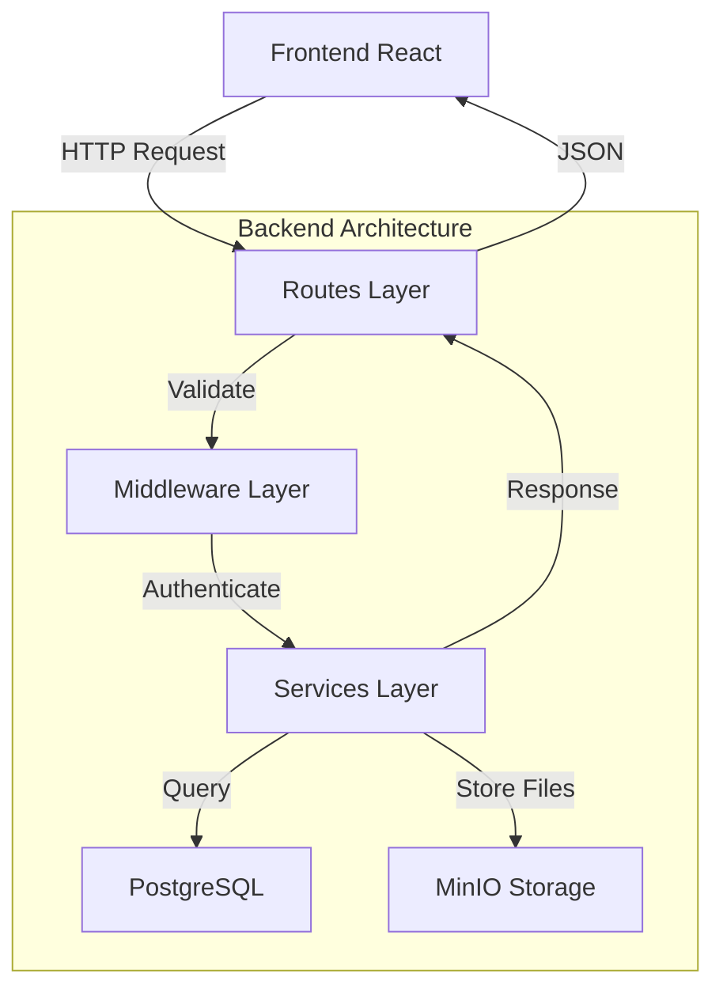
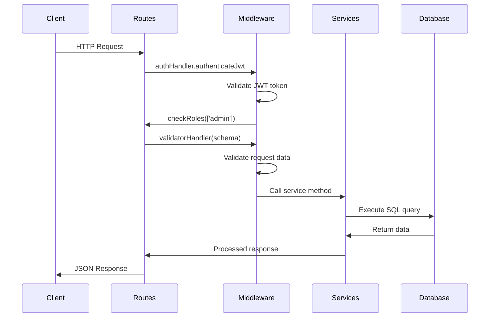
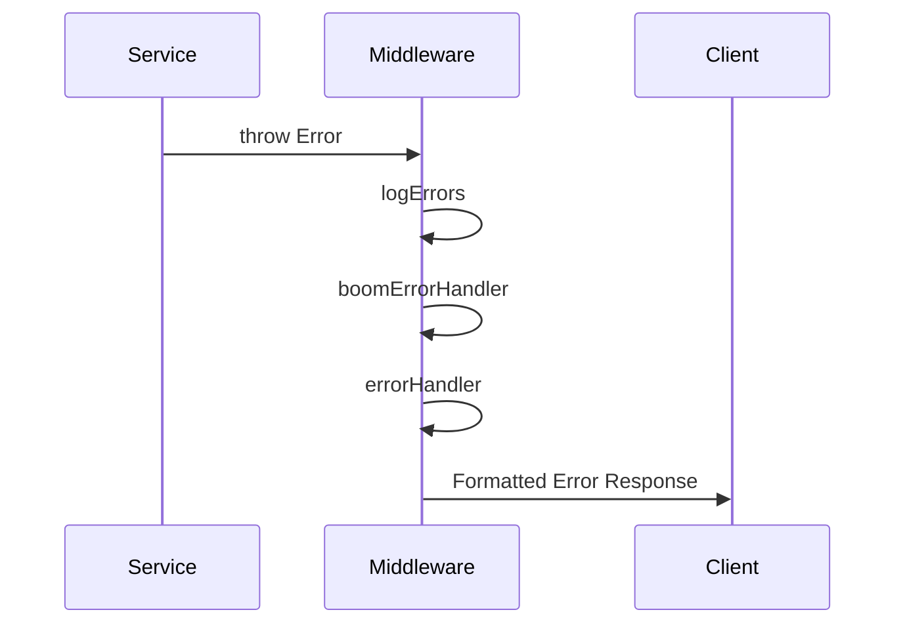
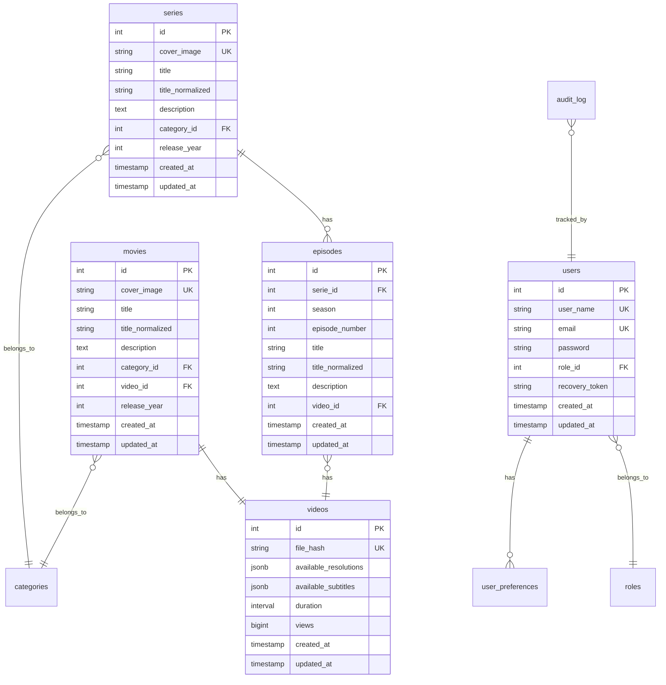
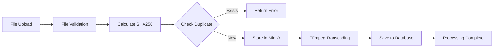

# 🏗️ Arquitectura del Backend - Streaming App

## 📋 Visión General

El backend está construido usando **Node.js + Express** siguiendo el patrón **MVC (Model-View-Controller)** con una arquitectura de servicios escalable y mantenible.

### 🎯 Principios de Diseño
- **Separación de responsabilidades** (MVC Pattern)
- **Reutilización de código** (BaseService Pattern)
- **Validación robusta** (Joi Schemas)
- **Seguridad first** (JWT + CORS + Input validation)
- **Escalabilidad horizontal** (Stateless design)

---

## 🏛️ Arquitectura MVC



### 📁 Estructura de Directorios

```
backend/app/
├── 📂 routes/           # 🌐 Controladores (Routes/Controllers)
│   ├── index.js         # Router principal (/api/v1)
│   ├── authRouter.js    # /auth endpoints
│   ├── moviesRoutes.js  # /movies endpoints
│   ├── seriesRoutes.js  # /series endpoints
│   ├── episodesRouter.js # /episodes endpoints
│   ├── categoriesRoutes.js # /category endpoints
│   ├── usersRoutes.js   # /users endpoints
│   └── userPreferencesRoutes.js # /user-preferences endpoints
│
├── 📂 services/         # 🔧 Lógica de Negocio (Business Logic)
│   ├── BaseService.js   # Clase base con funcionalidades comunes
│   ├── authService.js   # Autenticación y JWT
│   ├── moviesService.js # CRUD de películas + transcodificación
│   ├── seriesService.js # CRUD de series
│   ├── EpisodesService.js # CRUD de episodios
│   ├── categoriesService.js # CRUD de categorías
│   ├── usersService.js  # CRUD de usuarios
│   └── userPreferencesService.js # Preferencias de usuario
│
├── 📂 middleware/       # 🛡️ Middleware (Interceptors)
│   ├── authHandler.js   # JWT authentication + role validation
│   ├── validatorHandler.js # Joi schema validation
│   ├── errorHandler.js  # Error handling + Boom errors
│   ├── upload.js        # Multer file upload
│   └── completeInfoUser.js # User context injection
│
├── 📂 schemas/          # ✅ Validación de Datos (Data Validation)
│   ├── usersSchemas.js  # Esquemas de validación para usuarios
│   ├── moviesSchemas.js # Esquemas para películas
│   ├── seriesSchemas.js # Esquemas para series
│   ├── episodesSchema.js # Esquemas para episodios
│   ├── categoriesSchemas.js # Esquemas para categorías
│   └── userPreferencesSchemas.js # Esquemas para preferencias
│
├── 📂 utils/            # 🔨 Utilidades (Utilities)
│   ├── auth/            # Estrategias de autenticación
│   ├── database/        # Helpers de base de datos
│   ├── media/           # Procesamiento de archivos multimedia
│   ├── storage/         # Integración con MinIO S3
│   └── streaming/       # URLs únicas para streaming
│
├── 📂 config/           # ⚙️ Configuración
│   └── config.js        # Variables de entorno centralizadas
│
└── 📂 libs/             # 📚 Librerías Externas
    └── postgresPool.js  # Pool de conexiones PostgreSQL
```

---

## 🔄 Flujo de Request/Response

### 1. **Request Processing Flow**



### 2. **Error Handling Flow**



---

## 🛡️ Middleware Stack

### Orden de Ejecución (por prioridad)

1. **Express Middleware Global**
   ```javascript
   app.use(express.json({ limit: '10gb' }))
   app.use(cookieParser())
   app.use(cors(options))
   ```

2. **Route-Specific Middleware** (en cada endpoint)
   ```javascript
   router.post('/path',
     authenticateJwt,          // 🔐 Validar JWT
     checkRoles(['admin']),    // 👥 Validar roles
     multiUpload,              // 📁 Procesar archivos
     completeInfoUser,         // 👤 Inyectar contexto usuario
     validatorHandler(schema), // ✅ Validar esquema
     async (req, res, next) => { /* handler */ }
   )
   ```

3. **Error Handling Middleware** (al final)
   ```javascript
   app.use(logErrors)         // 📝 Log errores
   app.use(boomErrorHandler)  // 💥 Formatear errores Boom
   app.use(errorHandler)      // 🚨 Respuesta final de error
   ```

### 🔐 AuthHandler Middleware

**Funciones principales:**
- `authenticateJwt` - Validar token JWT desde cookies
- `checkRoles(roles)` - Verificar permisos por rol
- `checkApiKey` - Validar API key (opcional)

**Flujo de autenticación:**
```javascript
// 1. Extraer token de cookie 'access_token'
const token = req.cookies.access_token

// 2. Verificar token con JWT secret
const decoded = jwt.verify(token, config.jwtSecret)

// 3. Inyectar usuario en req.user
req.user = decoded

// 4. Verificar rol si es requerido
if (!allowedRoles.includes(req.user.role)) {
  throw boom.forbidden('Permisos insuficientes')
}
```

### ✅ ValidatorHandler Middleware

**Función:** Validar datos de entrada usando esquemas Joi

```javascript
function validatorHandler(schema, property) {
  return (req, res, next) => {
    const data = req[property] // 'body', 'params', 'query'
    const { error } = schema.validate(data, { abortEarly: false })
    
    if (error) {
      next(boom.badRequest(error.details))
    } else {
      next()
    }
  }
}
```

**Propiedades validadas:**
- `body` - Datos POST/PUT/PATCH
- `params` - Parámetros de URL (/:id)
- `query` - Query parameters (?key=value)

---

## 🔧 Services Layer

### BaseService Pattern

**Propósito:** Evitar duplicación de código entre servicios

```javascript
class BaseService {
  constructor() {
    this.pool = pool // PostgreSQL connection pool
  }

  // Utilidades comunes a todos los servicios
  async calculateFileHash(filePath) { /* SHA256 hash */ }
  async checkIfFileExistsInDatabase(hash) { /* Verificar duplicados */ }
  async withTransaction(callback) { /* Transacciones automáticas */ }
  parseJsonSafely(data, defaultValue) { /* JSON parsing seguro */ }
}
```

### Servicios Especializados

Cada servicio hereda de `BaseService` y agrega funcionalidad específica:

```javascript
class MoviesService extends BaseService {
  // CRUD Operations
  async create(data, progressCallback) { /* Crear película + transcodificar */ }
  async find() { /* Listar todas las películas */ }
  async findOne(id) { /* Obtener por ID */ }
  async findByFileHash(hash) { /* Obtener por hash para reproductor */ }
  async update(id, changes) { /* Actualizar película */ }
  async delete(id) { /* Eliminar película */ }
  
  // Business Logic
  async findByName(title) { /* Búsqueda por título */ }
  async searchByYearRange(from, to) { /* Búsqueda por años */ }
}
```

### Servicios Disponibles

| Servicio | Responsabilidad | Funciones Clave |
|----------|----------------|------------------|
| `authService` | Autenticación | `signToken`, `registerUser`, `sendRecoveryLink` |
| `moviesService` | Películas | CRUD + transcodificación + búsquedas |
| `seriesService` | Series | CRUD + gestión de temporadas |
| `EpisodesService` | Episodios | CRUD + vinculación con series |
| `categoriesService` | Categorías | CRUD simple |
| `usersService` | Usuarios | CRUD + gestión de roles |
| `userPreferencesService` | Preferencias | Configuración de usuario + progreso |

---

## 🗃️ Database Layer

### Esquema de Base de Datos



### Características de la Base de Datos

**🔍 Búsquedas Optimizadas:**
- Índices GIN para búsquedas full-text con pg_trgm
- Campos `title_normalized` para búsquedas case-insensitive
- Índices en foreign keys para JOINs rápidos

**📊 Sistema de Auditoría:**
- Tabla `audit_log` con triggers automáticos
- Rastreo de todas las operaciones CRUD
- Contexto de usuario y IP automático

**🔄 Integridad Referencial:**
- Foreign keys con DELETE CASCADE/RESTRICT apropiados
- Constraints de unicidad para evitar duplicados
- Triggers para `updated_at` automático

**📈 Optimizaciones:**
- Connection pooling con `pg`
- Transacciones automáticas en operaciones complejas
- JSONB para datos flexibles (resoluciones, subtítulos, preferencias)

---

## 📁 File Processing Architecture

### Media Processing Pipeline



### Componentes de Procesamiento

**🎬 Video Processing (`/utils/media/video/`):**
- `mp4-transcoder.js` - Transcodificación con FFmpeg
- `videoValidator.js` - Validación de formatos
- `transcodeSettings.js` - Configuraciones de calidad
- `subtitleProcessor.js` - Extracción de subtítulos

**🖼️ Image Processing (`/utils/media/image/`):**
- `imageProcessor.js` - Redimensionado con Sharp
- `imageDownloader.js` - Descarga de portadas TMDB

**☁️ Storage Integration (`/utils/storage/`):**
- `aws.js` - Cliente MinIO S3
- `fileHelpers.js` - Utilidades de archivos
- `getPresignedUrl.js` - URLs firmadas para streaming

### Configuración de Calidades

```javascript
// Perfiles de calidad configurables
const qualityProfiles = {
  'basic': ['480p'],
  'standard': ['480p', '720p'],
  'premium': ['480p', '720p', '1080p'],
  'ultra': ['480p', '720p', '1080p', '4k']
}
```

---

## 🔐 Security Architecture

### Autenticación y Autorización

**🎫 JWT Implementation:**
```javascript
// Token Structure
{
  "sub": 1,           // User ID
  "role": "admin",    // User role
  "iat": 1641234567,  // Issued at
  "exp": 1641320967   // Expires at (24h)
}
```

**🍪 Cookie Configuration:**
```javascript
{
  httpOnly: true,     // No accessible via JavaScript
  secure: false,      // true in production (HTTPS only)
  sameSite: 'lax',    // CSRF protection
  maxAge: 86400000    // 24 hours
}
```

### CORS Configuration

```javascript
const whiteList = [
  'http://localhost:3000',    // Frontend dev
  'https://yourdomain.com'    // Production domain
]

const corsOptions = {
  origin: (origin, callback) => {
    if (!origin || whiteList.includes(origin)) {
      callback(null, true)
    } else {
      callback(new Error('CORS: origen no permitido'))
    }
  },
  credentials: true  // Allow cookies
}
```

### Input Validation

**Joi Schema Example:**
```javascript
const createMovieSchema = Joi.object({
  title: Joi.string().min(1).max(255).required(),
  description: Joi.string().max(1000),
  categoryId: Joi.number().integer().positive().required(),
  releaseYear: Joi.number().integer().min(1900).max(2030).required()
})
```

### File Upload Security

```javascript
const multer = require('multer')

const fileFilter = (req, file, cb) => {
  // Video files only
  if (file.fieldname === 'video') {
    if (file.mimetype.startsWith('video/')) {
      cb(null, true)
    } else {
      cb(new Error('Solo archivos de video permitidos'))
    }
  }
  // Image files only
  else if (file.fieldname === 'coverImage') {
    if (file.mimetype.startsWith('image/')) {
      cb(null, true)
    } else {
      cb(new Error('Solo archivos de imagen permitidos'))
    }
  }
}
```

---

## 📊 Performance & Scalability

### Database Optimizations

**Connection Pooling:**
```javascript
const pool = new Pool({
  user: config.dbUser,
  password: config.dbPassword,
  host: config.dbHost,  
  port: config.dbPort,
  database: config.dbName,
  max: 20,           // Maximum connections
  idleTimeoutMillis: 30000,
  connectionTimeoutMillis: 2000
})
```

**Query Optimizations:**
- Prepared statements para consultas frecuentes
- Índices en columnas de búsqueda y foreign keys
- LIMIT y OFFSET para paginación
- Campos calculados (`title_normalized`) para búsquedas

### File Processing Scalability

**Asynchronous Processing:**
- Tasks con `taskId` para tracking
- Progress callbacks para UI updates
- Queue system para procesamiento batch
- Error recovery con retry logic

**Storage Optimization:**
- CDN integration con NGINX
- Presigned URLs para descarga directa
- Compression automática (gzip, brotli)
- Cache headers apropiados

### Monitoring & Logging

**Error Tracking:**
```javascript
// Custom error logger
const logErrors = (err, req, res, next) => {
  console.error(`[${new Date().toISOString()}] ${err.message}`)
  console.error(`Route: ${req.method} ${req.path}`)
  console.error(`User: ${req.user?.sub || 'Anonymous'}`)
  console.error(err.stack)
  next(err)
}
```

**Audit Trail:**
- Todas las operaciones CRUD registradas
- Contexto de usuario automático
- IP address tracking
- Timestamps precisos

---

## 🚀 Deployment Architecture

### Docker Services

```yaml
services:
  backend:
    build: ./backend/app
    environment:
      - NODE_ENV=production
      - JWT_SECRET=${JWT_SECRET}
    depends_on:
      - postgres
      - minio
  
  postgres:
    image: postgres:15
    volumes:
      - postgres_data:/var/lib/postgresql/data
      - ./servers/postgresQl/init.sql:/docker-entrypoint-initdb.d/
  
  minio:
    image: minio/minio
    command: server /data --console-address ":9001"
    volumes:
      - minio_data:/data
```

### Environment Variables

**Configuración requerida:**
```bash
# Database
DB_USER=streamingapp
DB_PASSWORD=securepassword
DB_HOST=postgres
DB_PORT=5432
DB_NAME=streamingApp

# JWT
JWT_SECRET=your-super-secret-jwt-key

# Storage
MINIO_ROOT_USER=minioadmin
MINIO_ROOT_PASSWORD=minioadmin123
MINIO_BUCKET=streaming-content

# API
BACK_PORT=3001
WHITE_LIST=http://localhost:3000,https://yourdomain.com
```

### Production Considerations

**Security Hardening:**
- HTTPS obligatorio en producción
- Secrets management con Docker secrets
- Rate limiting con express-rate-limit
- Helmet.js para security headers

**Performance Tuning:**
- Node.js cluster mode
- Redis para session storage
- NGINX reverse proxy
- CDN para assets estáticos

**Monitoring:**
- Health check endpoints
- Prometheus metrics
- Log aggregation (ELK stack)
- Error tracking (Sentry)

---

## 🔗 Integration Points

### Frontend Integration

**API Consumption:**
- Axios interceptors para token refresh
- Error handling centralizado
- File upload con progress tracking
- WebSocket para notificaciones real-time (futuro)

### Third-party Services

**TMDB Integration:**
- Metadata fetching automático
- Poster/backdrop download
- Release information enrichment

**Email Service:**
- Password recovery emails
- User notifications
- Admin alerts

### External Storage

**MinIO S3 Compatible:**
- Bucket organization por tipo de contenido
- Lifecycle policies para cleanup
- Replication para backup
- Access policies granulares

---

Este documento proporciona una visión completa de la arquitectura del backend. Para detalles específicos de implementación, consulta los archivos de código correspondientes y la [API Reference](./API_REFERENCE.md).